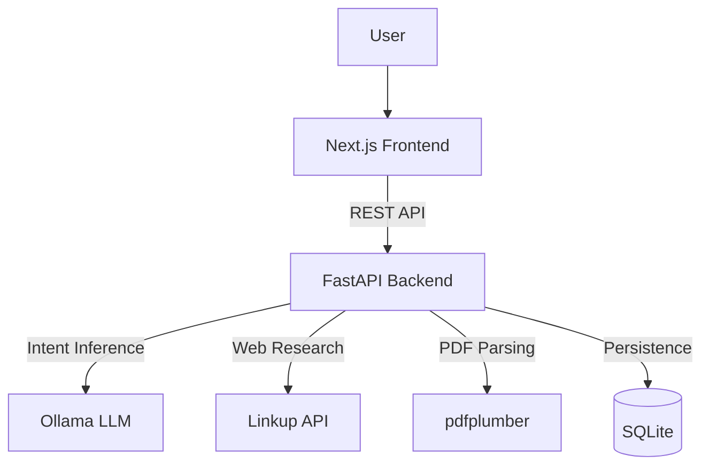

# Linkup-Navi

Desktop intelligence agent for meeting preparation and document analysis. Summarizes agendas, extracts deadlines, researches companies, and generates actionable briefings.

## Architecture



## Quick Start

```bash
# Backend
cd backend
pip install -r requirements.txt
cp .env.example .env  # Configure API keys
python run.py

# Frontend (separate terminal)
cd frontend
npm install
npm run dev
```

## Project Structure

```
├── backend/         # FastAPI server with planning & execution engine
├── frontend/       # Next.js UI with session management
├── PRD.md          # Product requirements document
└── .env.example    # Environment variables template
```

## Demo Workflow

1. Create a new session
2. Upload meeting documents (PDF, DOCX, TXT)
3. Enter natural language command (e.g., "Prepare for tomorrow's board meeting")
4. View generated summary, deadlines, risks, and action items
