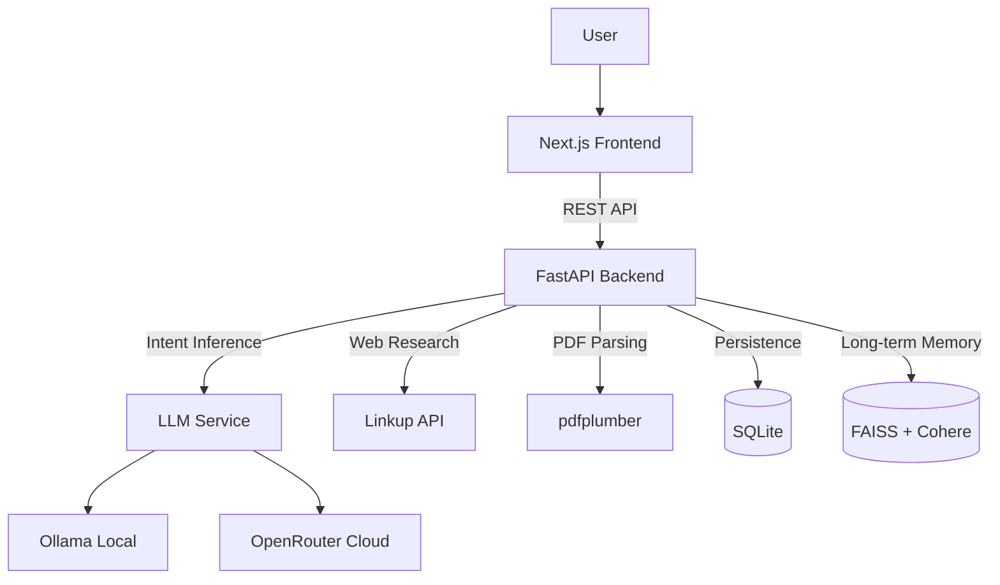

# Linkup-Navi

Desktop intelligence agent for meeting preparation and document analysis. Summarizes agendas, extracts deadlines, researches companies, and generates actionable briefings.

## Architecture



## Quick Start

```bash
# Backend
cd backend
pip install -r requirements.txt
cp .env.example .env  # Configure API keys
python run.py

# Frontend (separate terminal)
cd frontend
npm install
npm run dev
```

## Project Structure

```
├── backend/         # FastAPI server with planning & execution engine
├── frontend/       # Next.js UI with session management
├── PRD.md          # Product requirements document
└── .env.example    # Environment variables template
```

## Features

- **Meeting Preparation:** Upload documents and get AI-generated briefings
- **Document Analysis:** Extract deadlines, risks, and action items from PDFs
- **Web Research:** Automatic company/entity research via Linkup API
- **Multi-Step Planning:** Intent inference and goal decomposition
- **Real-time Progress:** Track execution status with live progress updates
- **Long-term Memory:** Vector-based memory with FAISS + Cohere embeddings
- **Dual LLM Support:** Local Ollama or cloud OpenRouter

## Demo Workflow

1. Create a new session
2. Upload meeting documents (PDF, TXT)
3. Enter natural language command (e.g., "Prepare for tomorrow's board meeting")
4. View generated summary, deadlines, risks, and action items
5. Track real-time execution progress

## Environment Variables

### Backend
```env
LINKUP_API_KEY=your_linkup_api_key
COHERE_API_KEY=your_cohere_api_key  # For vector embeddings
OLLAMA_BASE_URL=http://localhost:11434
OLLAMA_MODEL=qwen2.5:0.5b
OPENROUTER_API_KEY=your_openrouter_key  # Optional: for cloud LLM
```

### Frontend
```env
NEXT_PUBLIC_API_URL=http://localhost:8000/api/v1
```
