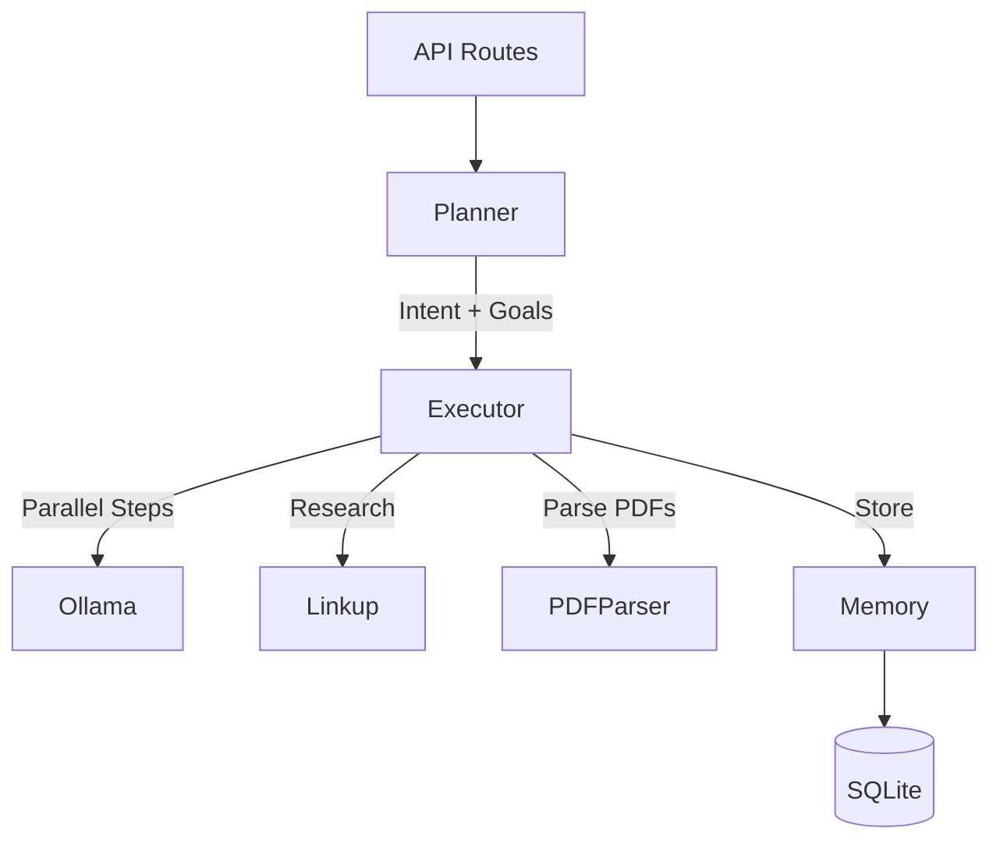

# Backend

FastAPI server implementing the Linkup-Navi intelligence agent with planning, execution, and research capabilities.

## Tech Stack

- **Framework:** FastAPI 0.115.0
- **Language:** Python 3.11+
- **Database:** aiosqlite (async SQLite)
- **LLM:** Ollama (Qwen 2.5 0.5B)
- **Web Research:** Linkup API
- **PDF Processing:** pdfplumber
- **Server:** Uvicorn

## Installation

```bash
pip install -r requirements.txt
```

## Environment Variables

```env
LINKUP_API_KEY=your_linkup_api_key
OLLAMA_BASE_URL=http://localhost:11434
OLLAMA_MODEL=qwen2.5:0.5b
```

## Running the Server

```bash
python run.py
# Or: uvicorn app.main:app --host 0.0.0.0 --port 8000 --reload
```

## Project Structure

```
backend/
├── app/
│   ├── main.py             # FastAPI entry point
│   ├── config.py           # Settings and configuration
│   ├── api/
│   │   └── routes/
│   │       ├── prep.py     # Meeting prep endpoints
│   │       └── files.py    # File upload endpoints
│   ├── core/
│   │   ├── planner.py      # Intent inference & goal decomposition
│   │   ├── executor.py     # Multi-step plan execution
│   │   └── evaluator.py    # Result evaluation
│   ├── services/
│   │   ├── ollama.py       # Ollama LLM client
│   │   ├── linkup.py       # Linkup API client
│   │   ├── memory.py       # Session memory management
│   │   └── pdf_parser.py   # PDF text extraction
│   ├── db/
│   │   ├── connection.py   # Database connection
│   │   └── schema.py       # Schema & repositories
│   └── models/             # Pydantic models
├── run.py                  # Server entry point
├── uploads/                # Uploaded files directory
└── requirements.txt
```

## Architecture



## API Endpoints

### Sessions

| Method | Endpoint | Description |
|--------|----------|-------------|
| POST | `/api/v1/sessions` | Create new session |
| GET | `/api/v1/sessions` | List all sessions |
| GET | `/api/v1/sessions/{id}` | Get session details |
| DELETE | `/api/v1/sessions/{id}` | Delete session |

### Files

| Method | Endpoint | Description |
|--------|----------|-------------|
| POST | `/api/v1/upload` | Upload document |

### Meeting Prep

| Method | Endpoint | Description |
|--------|----------|-------------|
| POST | `/api/v1/prep` | Execute meeting preparation |

### Health

| Method | Endpoint | Description |
|--------|----------|-------------|
| GET | `/health` | Health check |

## Core Modules

### planner.py
Intent inference and goal decomposition using Ollama. Takes natural language input and produces:
- Intent classification
- Goal breakdown
- Step dependencies

### executor.py
Multi-step plan execution engine. Executes steps in dependency order, supporting parallel execution. Handles:
- Step sequencing
- Dependency resolution
- Result aggregation
- Error handling

### services/ollama.py
Ollama LLM client wrapper. Handles:
- Model inference
- Prompt templating
- Response parsing

### services/linkup.py
Linkup API client for web research. Provides:
- Company/entity search
- Web snippet extraction
- Citation handling

### services/pdf_parser.py
PDF text extraction using pdfplumber. Extracts:
- Plain text content
- Metadata (pages, etc.)

### services/memory.py
Session memory management. Handles:
- Session persistence
- File tracking per session
- Context retrieval

### db/schema.py
SQLite schema and repositories. Tables:
- `sessions` - Session metadata
- `files` - Uploaded file references
- `plans` - Generated plans
- `results` - Execution results

## Database Schema

```sql
sessions (id, name, created_at, updated_at)
files (id, session_id, filename, file_type, uploaded_at)
plans (id, session_id, intent, goals, steps)
results (id, session_id, summary, deadlines, risks, actions)
```

## LLM Configuration

Default model: `qwen2.5:0.5b` (small, fast model for demos). Change via environment variable:

```env
OLLAMA_MODEL=qwen2.5:3b  # For better quality, slower inference
```

Ensure Ollama is running locally:

```bash
ollama serve
```

## File Handling

Uploaded files stored in `backend/uploads/`. Tracked in database per session. Supports:
- PDF (.pdf)
- Plain text (.txt)
- Word documents (.doc, .docx)

## Testing

```bash
# Run available tests
pytest
```
