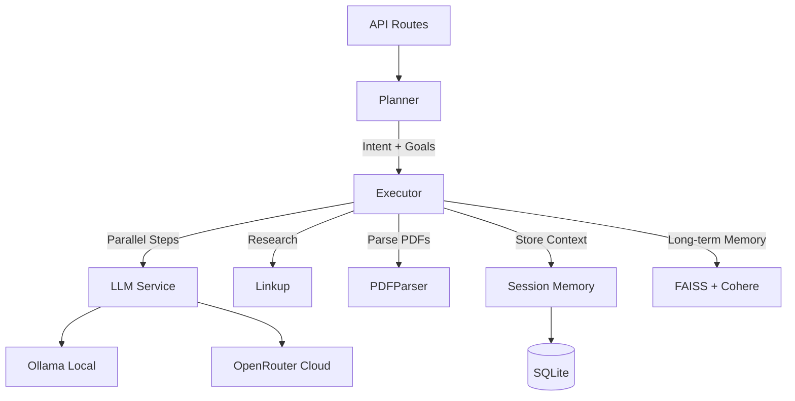

# Backend

FastAPI server implementing the Linkup-Navi intelligence agent with planning, execution, and research capabilities.

## Tech Stack

- **Framework:** FastAPI 0.115.0
- **Language:** Python 3.11+
- **Database:** aiosqlite (async SQLite)
- **Vector Store:** FAISS with Cohere embeddings
- **LLM:** Ollama (local) or OpenRouter (cloud)
- **Web Research:** Linkup API
- **PDF Processing:** pdfplumber
- **Server:** Uvicorn

## Installation

```bash
pip install -r requirements.txt
```

## Environment Variables

```env
LINKUP_API_KEY=your_linkup_api_key
COHERE_API_KEY=your_cohere_api_key  # For long-term memory embeddings
OLLAMA_BASE_URL=http://localhost:11434
OLLAMA_MODEL=qwen2.5:0.5b
OPENROUTER_API_KEY=your_openrouter_key  # Optional
```

## Running the Server

```bash
python run.py
# Or: uvicorn app.main:app --host 0.0.0.0 --port 8000 --reload
```

## Project Structure

```
backend/
├── app/
│   ├── main.py             # FastAPI entry point
│   ├── config.py           # Settings and configuration
│   ├── api/
│   │   ├── routes/
│   │   │   ├── prep.py     # Meeting prep endpoints
│   │   │   └── files.py    # File upload endpoints
│   │   └── memory.py       # Long-term memory endpoints
│   ├── core/
│   │   ├── planner.py      # Intent inference & goal decomposition
│   │   ├── executor.py     # Multi-step plan execution
│   │   └── evaluator.py    # Result evaluation & self-critique
│   ├── services/
│   │   ├── llm.py          # Unified LLM client (Ollama + OpenRouter)
│   │   ├── linkup.py       # Linkup API client
│   │   ├── pdf_parser.py   # PDF text extraction
│   │   ├── memory.py       # Session memory management
│   │   └── vector_memory.py # Long-term memory with FAISS
│   ├── db/
│   │   ├── connection.py   # Database connection
│   │   └── schema.py       # SQLite schema & repositories
│   └── models/             # Pydantic models
├── run.py                  # Server entry point
├── uploads/                # Uploaded files directory
└── requirements.txt
```

## Architecture



## API Endpoints

### Sessions

| Method | Endpoint | Description |
|--------|----------|-------------|
| POST | `/api/v1/sessions` | Create new session |
| GET | `/api/v1/sessions` | List all sessions |
| GET | `/api/v1/sessions/{id}` | Get session details |
| GET | `/api/v1/sessions/{id}/files` | List session files |
| GET | `/api/v1/sessions/{id}/execution-status` | Get real-time execution progress |
| DELETE | `/api/v1/sessions/{id}` | Delete session |

### Files

| Method | Endpoint | Description |
|--------|----------|-------------|
| POST | `/api/v1/upload` | Upload document (PDF, TXT) |

### Meeting Prep

| Method | Endpoint | Description |
|--------|----------|-------------|
| POST | `/api/v1/prep` | Execute meeting preparation |
| POST | `/api/v1/prep-with-files` | Meeting prep with required file references |

### Memory

| Method | Endpoint | Description |
|--------|----------|-------------|
| POST | `/api/v1/memory/add` | Add to long-term memory |
| POST | `/api/v1/memory/query` | Query long-term memory with similarity search |

### Health

| Method | Endpoint | Description |
|--------|----------|-------------|
| GET | `/health` | Health check |

## Core Modules

### planner.py
Intent inference and goal decomposition using LLM. Takes natural language input and produces:
- Intent classification
- Goal breakdown
- Step dependencies

### executor.py
Multi-step plan execution engine. Executes steps in dependency order, supporting parallel execution. Handles:
- Step sequencing
- Dependency resolution
- Result aggregation
- Error handling
- Real-time progress tracking

### services/llm.py
Unified LLM client supporting both local and cloud providers:
- **Ollama:** Local inference (default: qwen2.5:0.5b)
- **OpenRouter:** Cloud inference (configurable models)
- Prompt templating and response parsing

### services/linkup.py
Linkup API client for web research. Provides:
- Company/entity search
- Web snippet extraction
- Citation handling
- Mock fallback for demo/testing

### services/vector_memory.py
Long-term memory with vector embeddings:
- FAISS index for similarity search
- Cohere API for embeddings
- Document chunking and indexing
- Context retrieval for queries

### services/pdf_parser.py
PDF text extraction using pdfplumber. Extracts:
- Plain text content
- Metadata (pages, etc.)
- Deadline extraction from text

### services/memory.py
Session memory management. Handles:
- Session persistence
- File tracking per session
- Context retrieval
- SQLite-based storage

### db/schema.py
SQLite schema and repositories. Tables:
- `sessions` - Session metadata with user goal
- `session_files` - Uploaded file references
- `session_context` - Key-value context storage

**Note:** Plans and results are stored in-memory during execution and returned directly in API responses (not persisted to database).

## Database Schema

```sql
sessions (
    id TEXT PRIMARY KEY,
    created_at TIMESTAMP,
    updated_at TIMESTAMP,
    user_goal TEXT
)

session_files (
    id TEXT PRIMARY KEY,
    session_id TEXT REFERENCES sessions(id),
    file_name TEXT,
    file_path TEXT,
    file_type TEXT,
    uploaded_at TIMESTAMP
)

session_context (
    id TEXT PRIMARY KEY,
    session_id TEXT REFERENCES sessions(id),
    key TEXT,
    value TEXT,
    created_at TIMESTAMP
)
```

## LLM Configuration

Default configuration uses Ollama with qwen2.5:0.5b for fast, local inference. Supports dual providers:

### Local (Ollama)
```env
OLLAMA_BASE_URL=http://localhost:11434
OLLAMA_MODEL=qwen2.5:0.5b
```

### Cloud (OpenRouter)
```env
OPENROUTER_API_KEY=your_openrouter_key
OLLAMA_MODEL=openai/gpt-4o-mini  # Any OpenRouter model
```

Ensure Ollama is running locally:
```bash
ollama serve
```

## File Handling

Uploaded files stored in `backend/uploads/` and tracked in database per session.

**Supported formats:**
- PDF (.pdf) - Full support with vector indexing
- Plain text (.txt) - Basic support

**Planned (not yet implemented):**
- Word documents (.doc, .docx)

## Testing

```bash
# Run available tests
pytest
```

**Note:** Test suite not yet implemented for MVP.

## Key Features

1. **Dual LLM Support:** Switch between local Ollama and cloud OpenRouter
2. **Vector Memory:** Long-term memory with FAISS + Cohere embeddings
3. **Real-time Progress:** Execution status endpoint for live updates
4. **Execution Evaluation:** LLM-powered self-critique with completion scoring
5. **Parallel Execution:** Multi-step plans execute with dependency resolution
6. **Web Research:** Automatic Linkup API integration for entity research
