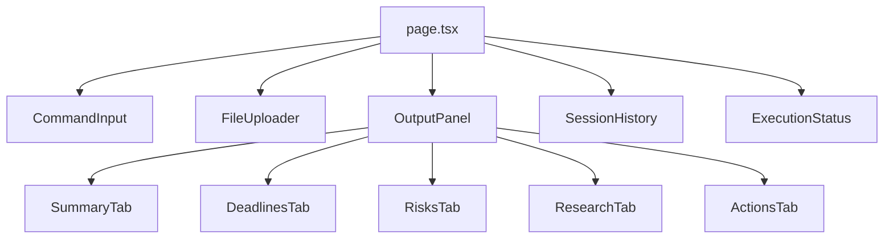

# Frontend

Next.js 16 application providing the user interface for Linkup-Navi.

## Tech Stack

- **Framework:** Next.js 16.1.6 (App Router)
- **Language:** TypeScript 5
- **Styling:** Tailwind CSS 4
- **Icons:** lucide-react
- **HTTP:** Native Fetch API

## Installation

```bash
npm install
```

## Environment Variables

```bash
NEXT_PUBLIC_API_URL=http://localhost:8000/api/v1
```

## Available Scripts

| Command | Description |
|---------|-------------|
| `npm run dev` | Start development server |
| `npm run build` | Build for production |
| `npm run lint` | Run ESLint |
| `npm run typecheck` | Run TypeScript compiler check |

## Project Structure

```
src/
├── app/
│   ├── layout.tsx          # Root layout with providers
│   ├── page.tsx            # Main session page
│   └── globals.css         # Global styles
├── components/
│   ├── CommandInput.tsx    # Natural language input with examples
│   ├── FileUploader.tsx    # Drag-and-drop file upload
│   ├── OutputPanel.tsx     # Tabbed results display
│   ├── ExecutionStatus.tsx # Real-time execution progress
│   ├── SessionHistory.tsx  # Session sidebar
│   └── ui/
│       ├── Button.tsx      # Reusable button
│       ├── Card.tsx        # Card container
│       └── Input.tsx       # Text input
├── lib/
│   ├── api.ts              # API client functions
│   └── utils.ts            # Utility functions
└── types/
    └── index.ts            # TypeScript type definitions
```

## Component Architecture



**Note:** OutputPanel tabs are rendered inline using conditional rendering, not as separate sub-components.

## API Integration

All API calls go through `src/lib/api.ts`:

| Function | Method | Endpoint | Description |
|----------|--------|----------|-------------|
| `createSession` | POST | `/sessions` | Create new session |
| `listSessions` | GET | `/sessions` | List all sessions |
| `getSession` | GET | `/sessions/{id}` | Get session details |
| `uploadFile` | POST | `/upload` | Upload document |
| `executePrep` | POST | `/prep` | Execute meeting prep |
| `getExecutionStatus` | GET | `/sessions/{id}/execution-status` | Get real-time execution progress |

**Note:** `deleteSession` endpoint is planned but not yet implemented.

## Key Components

### CommandInput
Natural language input with example commands. Accepts commands like:
- "Prepare for tomorrow's board meeting"
- "Summarize the Q4 budget document"
- "Research Acme Corp's recent news"

Features:
- Text input with Enter key submission
- 3 example command buttons
- Loading state handling

### FileUploader
Drag-and-drop supporting PDF, TXT, DOC, DOCX. Files are uploaded to backend and tracked by session.

Features:
- Drag-and-drop zone
- Click to select files
- File list with remove functionality
- Max 5 files limit

### OutputPanel
Tabbed display showing:
- **Summary:** Meeting overview with formatted text
- **Deadlines:** Extracted dates and obligations list
- **Risks:** Potential issues and concerns
- **Research:** Linkup web research results with entity info
- **Actions:** Generated actionable items list

### ExecutionStatus
Real-time execution progress tracking (bonus feature):
- Animated progress bar with shimmer effect
- 6-step progress visualization
- Polling mechanism (1 second intervals)
- Step-by-step completion tracking
- Current step and reasoning display

### SessionHistory
Sidebar showing saved sessions with:
- Session list with timestamps
- User goal preview
- Active session indicator
- Switch between sessions

## State Management

React hooks manage local state:
- `sessions` - List of available sessions
- `currentSession` - Active session ID
- `files` - Uploaded files for current session
- `isLoading` - API request state
- `output` - Meeting prep results
- `executionStatus` - Real-time execution progress

## Styling

Tailwind CSS with custom components in `src/components/ui/`. Features:
- Utility-first CSS pattern
- Glassmorphism card effects
- Custom animations (shimmer, fade)
- Responsive design
- Dark mode ready

## Build

```bash
npm run build
```

Output: `.next/` directory ready for deployment.

## Demo Features

1. **Create Session:** Start a new meeting prep workflow
2. **Upload Documents:** Drag-and-drop PDFs or text files
3. **Enter Commands:** Use natural language or click examples
4. **Track Progress:** Watch real-time execution status
5. **View Results:** Browse through 5 output tabs
